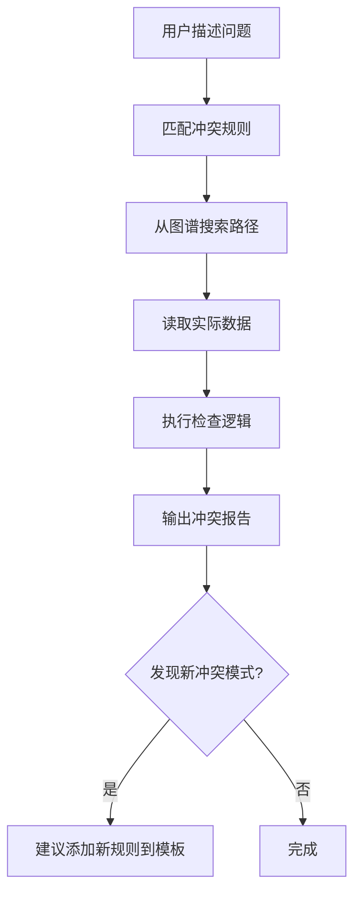

# 配表业务冲突检测技能

> 基于引用图谱自动发现和检测配表间的业务逻辑冲突。

## 前置依赖

本技能依赖两个项目文档，在执行任何检测前必须先确认它们存在：

1. **引用图谱**：`docs/config-reference-graph.md` — 记录所有表间引用关系
2. **冲突规则模板**：`docs/config-conflict-rules.yaml` — 定义检测规则

如果这两个文件不存在，先使用 `game-config-analyzer` 技能生成引用图谱，再手工创建冲突规则。

## 执行流程

### 步骤 1：理解用户问题

从用户的描述中提取：
- **关注实体**：Hero？Item？Skill？
- **关注系统**：哪些表/系统涉及？
- **冲突类型**：时间冲突？可见性？引用完整性？

### 步骤 2：匹配冲突规则

读取 `docs/config-conflict-rules.yaml`，找到匹配的规则模板。

如果用户的问题没有完全匹配的规则：
1. 从已有规则中选择最接近的
2. 根据用户描述调整检查逻辑
3. 建议用户将新规则添加到模板文件中

### 步骤 3：路径搜索

从 `docs/config-reference-graph.md` 中查找关联路径：

1. **BFS 搜索**：从用户提到的表 A 出发，在引用图谱中搜索到达表 B 的路径
2. **提取关键路径**：记录路径上的所有中间表和引用字段
3. **识别间接引用**：注意 ItemCfg[] 等结构体中的间接引用

路径搜索示例：
```
用户问：DrawFix 中的武将是否与 SeasonPass 冲突？

搜索路径：
DrawFix.ItemIds.ItemId → Item.Id
  Item.ItemParam → Hero（间接）
    Hero.Id ← SeasonPass.HeroId
    Hero.Id ← SeasonPassReward.HighReward → Item.Id（间接→Hero）

发现两条关联路径：
1. DrawFix → Item → Hero ← SeasonPass（直接 HeroId）
2. DrawFix → Item → Hero ← SeasonPassReward → SeasonPass（通过奖励间接）
```

### 步骤 4：读取数据执行检查

使用 `excel-parser` skill 或直接读取 Excel 文件：
1. 提取源表的关键字段数据
2. 沿引用路径解析，得到最终关联的实体 ID
3. 应用冲突规则中的检查逻辑
4. 记录所有冲突点

### 步骤 5：输出冲突报告

格式：

```markdown
## 冲突检测报告

**检测规则**：时间窗口独占冲突
**检测范围**：DrawFix ↔ SeasonPass
**检测时间**：YYYY-MM-DD

### 检测路径
DrawFix.ItemIds → Item → Hero ← SeasonPass

### 冲突列表

| 严重度 | DrawFix 记录 | SeasonPass 记录 | 冲突描述 |
|--------|-------------|----------------|---------|
| 🔴 严重 | DrawFix#3, 武将X, 开放于2026-04-01 | SeasonPass#5, 武将X, 独占至2026-06-01 | 武将X在战令独占期前出现在定向招募中 |

### 总结
- 检查 N 条记录，发现 M 个冲突
- 严重: X, 警告: Y, 信息: Z
```

## 内置规则速查

| 规则 | 关注点 | 典型场景 |
|------|--------|---------|
| 时间窗口独占冲突 | 两个系统引用同一实体且时间重叠 | 战令武将出现在定向招募 |
| 可见性泄漏 | 隐藏实体被意外暴露 | 隐藏道具出现在商店 |
| 禁用冲突 | 禁用实体在另一系统可用 | 竞技禁用武将出现在 PVE |
| 道具过期泄漏 | 过期道具仍被活跃系统引用 | 限时道具掉落规则过期仍被引用 |
| 重复奖励冲突 | 同一实体在多系统并行配置 | 同一武将同时出现在战令和首充 |
| 引用完整性 | 外键指向不存在的记录 | SeasonPassId 不存在 |
| 充值互斥冲突 | 互斥充值项同时开放 | 两个互斥充值档位时间重叠 |

## 工作流



## 与其他 Skill 的协作

- **excel-parser** — 读取单个表的数据
- **game-config-analyzer** — 生成/更新引用图谱
- **xlsx** — 如需修改有冲突的 Excel 文件

## 扩展指南

### 添加新的冲突规则

1. 在 `docs/config-conflict-rules.yaml` 中添加新规则
2. 按现有格式填写 name、description、pattern、check_logic
3. 在本文件"内置规则速查"中添加一行

### 添加新的引用路径

1. 在 `docs/config-reference-graph.md` 中添加引用关系
2. 新的引用路径自动适用于所有现有冲突规则

### 发现新冲突模式

当检测过程中发现未在规则模板中定义的冲突模式时：
1. 记录冲突的完整描述
2. 分析冲突的本质模式
3. 建议用户将其添加为新的冲突规则
4. 在报告中标注"新发现模式"
