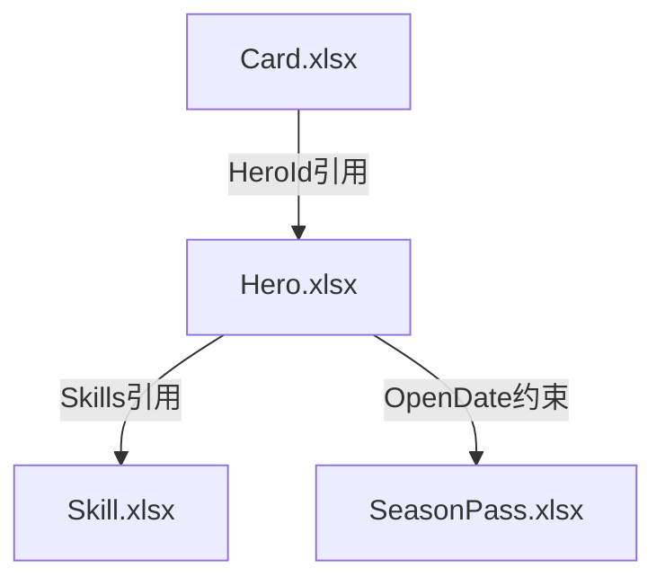

# 游戏配表分析技能

> 快速深入了解新项目的配表逻辑，自动分析表关系、提取约束规则、生成可视化图表和文档。

## 快速开始

### 前置条件

本技能依赖以下工具：
- `openpyxl` - Python Excel 处理库
- Excel 配表文件（.xlsx 格式）

安装依赖：
```bash
pip install openpyxl python-dateutil
```

### 工具选择策略

本技能采用**灵活的工具选择策略**，优先级：
1. **项目特定工具** - 检测 `.gameconfig.yaml` 或项目脚本
2. **本地 MCP 服务** - 检测 `excel-parser`、`gameconfig` 等服务
3. **技能自带脚本** - `analyzer.py` 作为兜底

### Subagent 并行调度

对于大型项目（100+ 配置表），本技能支持 **Subagent 并行调度**，将分析任务拆分为多个并行子任务：

```
┌─────────────────────────────────────────────────┐
│              分析请求                           │
└─────────────────────────────────────────────────┘
                    │
    ┌───────────────┼───────────────┐
    ▼               ▼               ▼
┌─────────┐   ┌─────────┐   ┌─────────┐
│ Agent 1 │   │ Agent 2 │   │ Agent 3 │
│ 核心表   │   │ 枚举表   │   │ 活动表   │
└─────────┘   └─────────┘   └─────────┘
    │               │               │
    └───────────────┼───────────────┘
                    ▼
          结果汇总 → 生成报告
```

**使用场景**：
- 大型项目快速分析
- 需要并行处理多个类别
- 时间敏感的分析任务

**详细文档**: [10-subagent-scheduling.md](references/10-subagent-scheduling.md)

## 功能导航

### 核心功能
- **[配表扫描](#配表扫描)** - 发现和收集所有配表文件
- **[关系分析](#关系分析)** - 分析表之间的引用关系
- **[约束提取](#约束提取)** - 提取字段校验规则
- **[可视化生成](#可视化生成)** - 生成图表和关系图
- **[测试数据生成](#测试数据生成)** - 生成验证测试数据
- **[文档生成](#文档生成)** - 生成分析文档

### 高级功能
- **[差异分析](#差异分析)** - 对比两个版本的配表
- **[影响分析](#影响分析)** - 评估修改影响范围
- **[数据验证](#数据验证)** - 完整性和一致性检查

### 交互工具
- **[全文搜索](#全文搜索)** - 跨所有配表搜索特定值
- **[批量操作](#批量操作)** - 批量修改、添加/删除字段
- **[配置模拟器](#配置模拟器)** - What-if 分析

### AI 功能
- **[智能推荐](#智能推荐)** - 基于分析提供优化建议
- **[反模式检测](#反模式检测)** - 检测设计反模式

## 配表扫描

扫描指定目录，收集所有 Excel 配表文件及其结构信息。

**输出格式**：
```
配表文件清单 (共 N 个文件)

文件名 | Sheet列表 | 行数 | 主要字段
------|----------|------|----------
Hero.xlsx | Hero | 152 | Id, Name, Quality, OpenDate
Skill.xlsx | Skill | 89 | Id, Name, Type, Damage
...
```

## 关系分析

分析表之间的引用关系（ID引用、枚举引用、时间同步等）。

**关系类型**：
| 类型 | 说明 | 示例 |
|------|------|------|
| 直接引用 | A表.字段 → B表.主键 | Hero.Skills → Skill.Id |
| 时间约束 | A表.时间 ∈ B表.时间范围 | Hero.OpenDate ∈ SeasonPass.StartTime~EndTime |
| 枚举约束 | A表.字段 = B表.枚举值 | Hero.Country = ECountry.枚举 |

**关系图示例**：


## 约束提取

从配表结构中自动提取校验规则。

**约束类型**：
1. **时间约束** - StartTime < EndTime，OpenDate ∈ [开始, 结束]
2. **数值约束** - 范围限制、倍数关系
3. **枚举约束** - 字段值必须是枚举中的某个值
4. **引用约束** - 外键必须存在于目标表中
5. **条件约束** - IsOpen=true 时 OpenDate 必须有值

## 可视化生成

生成 Mermaid 格式的表关系依赖图，支持：
- 中心表/边缘表分类
- 约束关系标注
- 层级关系展示

## 测试数据生成

基于提取的约束规则，生成验证测试数据。

**测试场景类型**：
1. **边界值测试** - 等于边界值
2. **异常值测试** - 违反约束
3. **正常值测试** - 符合所有约束
4. **空值测试** - 测试空值处理

## 文档生成

生成结构化的配表分析文档，包含：
- 配表总览
- 表关系分析
- 约束规则汇总
- 可疑配置检测

## 差异分析

对比两个版本的配表，高亮变更：
- 新增/删除的表
- 新增/删除的字段
- 数据变更的行

## 影响分析

评估修改影响范围：
- 直接影响表
- 间接影响表
- 风险等级评估

## 数据验证

执行完整性和一致性检查：
- 外键引用完整性
- 枚举值有效性
- 必填字段检查
- 跨表一致性

## 全文搜索

跨所有配表搜索特定值，支持：
- 精确匹配
- 模糊匹配
- 正则表达式

## 批量操作

批量修改配表：
- 添加字段
- 删除字段
- 修改值
- 批量替换

## 配置模拟器

What-if 分析：
- 预览变更影响
- 评估变更风险
- 生成变更报告

## 智能推荐

基于分析结果提供优化建议：
- 结构优化建议
- 约束补充建议
- 命名规范建议
- 性能优化建议
- 数据质量建议

**推荐类型**：
| 类型 | 说明 | 示例 |
|------|------|------|
| structure | 结构优化 | 大表分表、字段拆分 |
| constraint | 约束补充 | 时间顺序约束、外键完整性 |
| naming | 命名规范 | ID 后缀位置、命名风格统一 |
| performance | 性能优化 | 热门表缓存、减少引用 |
| quality | 数据质量 | 冗余字段检测 |

## 反模式检测

检测配表中的设计反模式：

| 反模式 | 严重度 | 说明 |
|--------|--------|------|
| 循环引用 | 🔴 高 | A → B → A 形成循环 |
| 孤立表 | 🔵 信息 | 与其他表无关联 |
| 过度依赖 | 🟡 中 | 单表引用过多其他表 |
| 深度嵌套 | 🟡 中 | 引用链路过深 |
| 贫血模型 | 🟢 低 | 只有 ID 引用，缺少业务字段 |

## 使用流程

```
步骤 1: 配表扫描
→ 输入: 配表目录路径
→ 输出: 配表清单文件列表

步骤 2: 结构分析
→ 读取每个配表的表头信息
→ 提取字段名、类型、注释

步骤 3: 关系分析
→ 分析字段名引用关系
→ 分析时间字段约束
→ 生成关系图

步骤 4: 约束提取
→ 从字段名推断约束类型
→ 从注释提取业务规则

步骤 5: 文档生成
→ 组合所有分析结果
→ 生成 Markdown 文档
```

## 记忆存储

分析结果自动存储到记忆中：
- **MCP 记忆服务器** - 优先使用
- **项目记忆目录** - `{项目}/.claude/memory/`
- **用户全局记忆** - `~/.claude/projects/{项目}/memory/`

## 详细文档

更多详细信息请参考：
- **[references/](references/)** - 完整功能文档
- **[09-quick-reference.md](references/09-quick-reference.md)** - ⭐ 快速参考 (脚本命令速查)
- **[01-core-analysis.md](references/01-core-analysis.md)** - 核心分析功能详解
- **[02-diff-impact.md](references/02-diff-impact.md)** - 差异与影响分析
- **[03-validation.md](references/03-validation.md)** - 验证引擎
- **[04-interactive.md](references/04-interactive.md)** - 交互工具
- **[05-visualization.md](references/05-visualization.md)** - 可视化增强
- **[06-ai-features.md](references/06-ai-features.md)** - AI 功能
- **[07-memory-storage.md](references/07-memory-storage.md)** - 记忆存储
- **[08-tool-selection.md](references/08-tool-selection.md)** - 工具选择策略
- **[10-subagent-scheduling.md](references/10-subagent-scheduling.md)** - ⭐ Subagent 并行调度

## 最佳实践

### 1. 渐进式分析

```
第1轮: 快速扫描
→ 获取配表清单和基本结构

第2轮: 深度分析
→ 分析表关系和约束

第3轮: 文档生成
→ 生成完整分析报告
```

### 2. 分层级文档

对于大型项目，使用分层文档结构：
```
总览文档 (index.md)
├── 中心网络分析.md
├── 玩法系统分析.md
├── 独立系统分析.md
└── 约束规则汇总.md
```

### 3. 图表优先

先生成可视化图表，再补充文字说明：
1. 关系依赖图 - 快速理解全局
2. 约束索引表 - 快速查找规则
3. 详细分析 - 深入了解细节

## 常见问题

### Q: 如何处理非标准配表格式？

A: 本技能基于标准 4 行表头格式。对于非标准格式：
1. 检测数据起始行
2. 识别表头行模式
3. 适配不同格式

### Q: 关系分析不准确怎么办？

A: 提高准确性的方法：
1. 优先使用字段名匹配（如 `XxxId` → `Xxx.Id`）
2. 结合注释信息判断
3. 手动确认关键关系

### Q: 如何处理循环引用？

A: 检测并报告循环引用：
1. 构建依赖图时跟踪访问路径
2. 检测重复访问的节点
3. 在文档中标注循环引用
