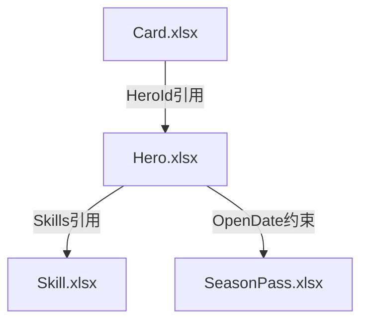

# 游戏配表分析技能

> 跨表关联分析与全局数据校验。教 AI 如何系统性地分析游戏配表，不依赖特定工具。

<<<<<<< HEAD
## 自适应初始化

本技能支持零配置使用——在新项目首次使用时自动探测配表格式，无需手动设置。

### 初始化检测（每次触发时首先执行）

**检查项目根目录是否存在 `.gameconfig.yaml`：**

- **存在** → 读取配置，跳过探测，直接使用已发现的格式参数
- **不存在** → 进入首次初始化模式（自动执行，无需用户干预）

### 首次初始化流程

当检测到新项目时，运行 `py scripts/analyzer.py --init <配表目录>`，自动执行：

1. **目录探测** — 扫描项目目录找到 xlsx 文件集中位置，检测 enum 子目录
2. **格式采样** — 选取 5~10 个代表性文件，读取前 8 行，对每行做角色评分
3. **投票确定** — 跨文件投票确定：字段名在第几行、类型行、描述行、导出标识行、数据起始行
4. **引用模式发现** — 收集所有字段名，统计后缀频率，发现项目的引用命名约定
5. **生成配置** — 写入 `.gameconfig.yaml`，后续使用直接读取

### 行角色检测信号

| 角色 | 判定规则 | 典型特征 |
|------|---------|---------|
| field_name | 匹配 `^[A-Za-z_][A-Za-z0-9_]*$` | Id, Name, SkillId, HeroItemId |
| type | 匹配 int/string/bool 或 `E#`开头 或 `[]`结尾 或 `#`开头 | int, string, ESkillId, # |
| description | 含 CJK 字符 (`\u4e00-\u9fff`) | 英雄ID, 技能名称 |
| export_tag | 含 server/client（不区分大小写） | server, client, server/client |

### 优雅降级

如果自动探测置信度过低（<50%），回退到默认假设：
- 4 行表头（描述→类型→字段名→导出标识），数据从第 5 行开始
- 引用模式为 `XxxId → Xxx.Id`
- 在 `.gameconfig.yaml` 中标记 `confidence: low`，提示用户手动确认

### 手动配置

用户可手动创建或编辑 `.gameconfig.yaml`。详见 [11-adaptive-init.md](references/11-adaptive-init.md)。

---

## 执行纪律（触发后必须遵守）
=======
## 核心方法论
>>>>>>> 5deb70e (refactor: 技能体系重构)

### 自适应初始化

<<<<<<< HEAD
1. **初始化检测** — 检查 `.gameconfig.yaml` 是否存在，不存在则自动执行自适应初始化（见上方章节）
2. **扫描定位** — 根据配置确定配表目录，扫描相关文件（按文件名/关键词/表头内容）
3. **读取结构** — 根据配置中检测到的表头格式读取目标表字段（不假设固定行数）
4. **交叉引用** — 追踪数据链路，找到表之间的关联（使用配置中发现的引用模式）
5. **约束提取** — 提取字段级校验规则（必填、引用完整性、时间顺序、枚举有效性、格式合法性）
6. **文档输出** — 将结果整理为 Markdown 文档，保存到项目的 docs/ 目录

**为什么这很重要**：跳过步骤会导致分析不完整。自适应初始化确保技能在不同项目中都能正确理解表头格式，避免因格式假设错误导致字段提取失败。后续的交叉引用和约束提取则保证了分析深度。
=======
首次分析新项目时，自动探测配表格式：

1. **目录探测** — 扫描项目目录找到 xlsx 文件集中位置
2. **格式采样** — 选取 5~10 个代表性文件，读取前 8 行
3. **投票确定** — 跨文件投票确定：字段名在第几行、类型行、描述行、导出标识行
4. **引用模式发现** — 收集所有字段名，统计后缀频率，发现项目的引用命名约定
>>>>>>> 5deb70e (refactor: 技能体系重构)

**行角色检测信号**：

| 角色 | 判定规则 | 典型特征 |
|------|---------|---------|
| field_name | 匹配 `^[A-Za-z_][A-Za-z0-9_]*$` | Id, Name, SkillId |
| type | 匹配 int/string/bool 或 `E#`开头 或 `[]`结尾 | int, string, ESkillId |
| description | 含 CJK 字符 | 英雄ID, 技能名称 |
| export_tag | 含 server/client | server, client |

**优雅降级**：如果自动探测置信度过低（<50%），回退到默认假设：
- 4 行表头（描述→类型→字段名→导出标识），数据从第 5 行开始
- 引用模式为 `XxxId → Xxx.Id`

### 执行框架

**一旦本技能被触发，按以下步骤执行**：

1. **环境感知** — 检查当前可用的工具（skill、MCP、项目脚本）
2. **扫描定位** — 确定配表目录，扫描相关文件
3. **读取结构** — 根据探测到的表头格式读取目标表字段
4. **交叉引用** — 追踪数据链路，找到表之间的关联
5. **约束提取** — 提取字段级校验规则
6. **文档输出** — 将结果整理为 Markdown 文档

### 常见游戏引用模式

| 模式 | 说明 | 示例 |
|------|------|------|
| `XxxId` → 同名表 | ID引用 | `SkillId` → Skill表 |
| `{ID;数量}` | 奖励/物品格式 | `{1000005;1}{1000011;10}` |
| `E#枚举名` | 枚举类型 | `EWeather` → enum/EWeather_enum.xlsx |
| `ItemCfg[]` | 物品配置数组 | Reward字段 |
| Sheet名含 `中\|英` | 竖线后为英文名 | `成就表\|Achieve` |

## 工具选择策略

**本技能不硬编码任何特定工具名称**。AI 应根据当前会话上下文自行判断：

```
1. 查看当前可用的 Skill
   → 系统提示中列出的 skill 列表
   → 根据 skill 描述判断能力匹配度

2. 查看可用的 MCP 工具
   → 使用 ListMcpResourcesTool 获取可用服务
   → 查找支持 Excel/配表操作的工具

3. 查看项目文档
   → 读取 CLAUDE.md / agent.md
   → 了解项目特定的工具或脚本

4. 使用自带脚本
   → scripts/analyzer.py 作为兜底方案
   → 直接读取 Excel 进行分析
```

**原则**：
- 不假设任何特定工具存在
- 根据实际可用性选择
- 优先使用项目指定的工具（如果有）
- 自带脚本始终可用

## 快速开始

### 前置条件

```bash
pip install openpyxl python-dateutil
```

### 分析流程

```bash
# 步骤 1: 扫描配表
py scripts/analyzer.py --scan <配表目录>

# 步骤 2: 分析关系
py scripts/analyzer.py --analyze <配表目录>

# 步骤 3: 生成文档
# 结果输出到 docs/config-analysis.md
```

### 两种分析模式

- **全量扫描**（分析整个项目）→ 先获取全局关系图，再逐系统深入
- **聚焦分析**（具体系统/字段）→ 从目标表出发，增量发现关联表

## 核心功能

### 关系分析

分析表之间的引用关系：

| 类型 | 说明 | 示例 |
|------|------|------|
| 直接引用 | A表.字段 → B表.主键 | Hero.Skills → Skill.Id |
| 时间约束 | A表.时间 ∈ B表.时间范围 | Hero.OpenDate ∈ SeasonPass 时间范围 |
| 枚举约束 | A表.字段 = B表.枚举值 | Hero.Country = ECountry.枚举 |

**关系图示例**：


### 约束提取

从配表结构中自动提取校验规则：

1. **时间约束** — StartTime < EndTime，OpenDate ∈ [开始, 结束]
2. **数值约束** — 范围限制、倍数关系
3. **枚举约束** — 字段值必须是枚举中的某个值
4. **引用约束** — 外键必须存在于目标表中
5. **条件约束** — IsOpen=true 时 OpenDate 必须有值

### 影响分析

评估修改某张表后的影响范围：
- **直接影响** — 直接引用该表的表
- **间接影响** — 通过引用链间接影响的表
- **风险等级** — 基于影响表数量和中心度评估

### 反模式检测

| 反模式 | 严重度 | 说明 |
|--------|--------|------|
| 循环引用 | 🔴 高 | A → B → A 形成循环 |
| 孤立表 | 🔵 信息 | 与其他表无关联 |
| 过度依赖 | 🟡 中 | 单表引用过多其他表 |
| 深度嵌套 | 🟡 中 | 引用链路过深 |

## 扩展与改进指南

### 何时需要扩展

| 场景 | 扩展方向 |
|------|---------|
| 需要新的引用模式识别 | 在 analyzer.py 中添加模式规则 |
| 需要新的约束类型 | 在约束提取逻辑中添加识别规则 |
| 需要集成到 CI/CD | 添加命令行参数和退出码 |
| 需要导出不同格式 | 添加 JSON/CSV/YAML 输出 |

### 如何扩展

**步骤 1**：修改 `scripts/analyzer.py`
- 添加新的分析方法
- 更新引用模式识别逻辑

**步骤 2**：测试
```bash
py scripts/analyzer.py --scan <测试目录>
```

**步骤 3**：更新 SKILL.md
- 在"常见游戏引用模式"表格中添加新行
- 在"扩展场景"中补充说明

### 替代方案

当自带脚本无法满足需求时：
1. **直接使用 Python + openpyxl** — 自定义分析逻辑
2. **使用 pandas** — 复杂数据处理和统计
3. **使用其他 skill** — 单表查询用 excel-parser，格式操作用 xlsx

## 详细文档

<<<<<<< HEAD
更多详细信息请参考：
- **[references/](references/)** - 完整功能文档
- **[09-quick-reference.md](references/09-quick-reference.md)** - ⭐ 快速参考 (脚本命令速查)
- **[01-core-analysis.md](references/01-core-analysis.md)** - 核心分析功能详解
- **[02-diff-impact.md](references/02-diff-impact.md)** - 差异与影响分析
- **[03-validation.md](references/03-validation.md)** - 验证引擎
- **[04-interactive.md](references/04-interactive.md)** - 交互工具
- **[05-visualization.md](references/05-visualization.md)** - 可视化增强
- **[06-ai-features.md](references/06-ai-features.md)** - AI 功能
- **[07-memory-storage.md](references/07-memory-storage.md)** - 记忆存储
- **[08-tool-selection.md](references/08-tool-selection.md)** - 工具选择策略
- **[10-subagent-scheduling.md](references/10-subagent-scheduling.md)** - ⭐ Subagent 并行调度
- **[11-adaptive-init.md](references/11-adaptive-init.md)** - ⭐ 自适应初始化与项目配置
=======
- **[references/09-quick-reference.md](references/09-quick-reference.md)** — 脚本命令速查
- **[references/01-core-analysis.md](references/01-core-analysis.md)** — 核心分析功能详解
- **[references/11-adaptive-init.md](references/11-adaptive-init.md)** — 自适应初始化完整参考
- **[references/02-diff-impact.md](references/02-diff-impact.md)** — 差异与影响分析
- **[references/03-validation.md](references/03-validation.md)** — 验证引擎
>>>>>>> 5deb70e (refactor: 技能体系重构)

## 相关技能

- **excel-parser** — 单表数据查询
- **xlsx** — 通用 Excel 操作（格式化、公式）
- **game-meta** — 导出游戏运行用的 CSV
