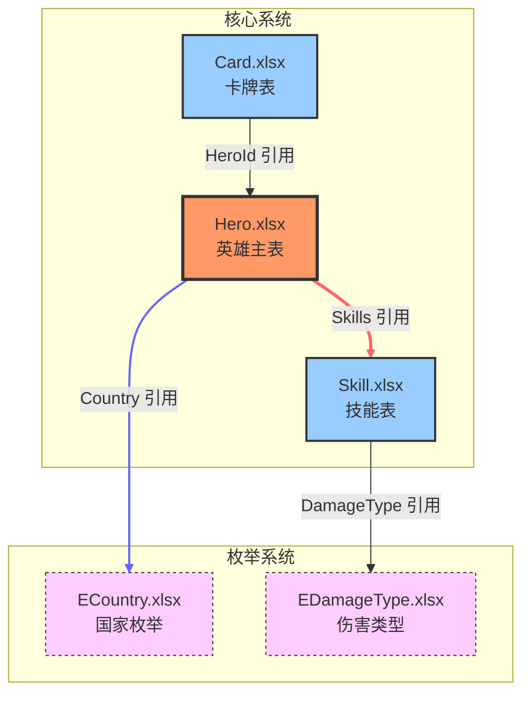

# 可视化增强

本文档详细说明配表分析的可视化增强功能。

## 目录

- [交互式图表](#交互式图表)
- [热力图](#热力图)
- [时间线视图](#时间线视图)
- [图表输出格式](#图表输出格式)

---

## 交互式图表

### 功能概述

生成交互式的关系图，支持：
- **缩放** - 放大/缩小查看细节
- **筛选** - 按表类型/关系类型筛选
- **高亮** - 高亮选中表及其关联
- **布局** - 多种布局算法

### 图表类型

| 类型 | 说明 | 适用场景 |
|------|------|----------|
| 力导向图 | 节点自动布局 | 大型关系网络 |
| 层级图 | 按层级排列 | 清晰的依赖关系 |
| 环形图 | 中心辐射型 | 以某表为中心的关系 |

### Mermaid 增强语法



### D3.js 可视化

```javascript
// 生成交互式 D3.js 图表
function generateInteractiveGraph(relations) {
    const nodes = extractNodes(relations);
    const links = extractLinks(relations);

    const simulation = d3.forceSimulation(nodes)
        .force("link", d3.forceLink(links).id(d => d.id))
        .force("charge", d3.forceManyBody().strength(-300))
        .force("center", d3.forceCenter(width / 2, height / 2));

    // 添加缩放功能
    const zoom = d3.zoom()
        .scaleExtent([0.1, 4])
        .on("zoom", (event) => {
            g.attr("transform", event.transform);
        });

    svg.call(zoom);

    // 添加节点点击事件
    node.on("click", (event, d) => {
        highlightConnections(d);
    });

    return { svg, simulation };
}
```

---

## 热力图

### 功能概述

展示配表的各种统计数据：
- **字段使用频率** - 哪些字段最常被引用
- **约束违反密度** - 哪些表/字段最容易出错
- **数据分布** - 数值分布情况

### 热力图类型

#### 1. 字段引用热力图

```
字段引用频率热力图

字段名         引用次数    热度
Id              150       ████████████
Name            85        ███████
Type            62        █████
Quality         45        ████
OpenDate        38        ███
```

#### 2. 约束违反热力图

```
约束违反密度热力图

表名           违反数    密度
Hero.xlsx       12       ████████
Card.xlsx        8       ██████
Skill.xlsx       5       ████
Arena.xlsx       3       ██
```

#### 3. 数值分布热力图

```
英雄等级分布热力图

等级段      数量    占比
1-20        450     30%  ████████████
21-40       380     25%  █████████
41-60       320     21%  ████████
61-80       230     15%  ██████
81-100      120      8%  ███
```

### 生成代码

```python
def generate_field_heatmap(relations: List[Dict]) -> Dict:
    """生成字段引用热力图"""
    field_counts = defaultdict(int)

    # 统计字段被引用次数
    for rel in relations:
        target_field = f"{rel['target_table']}.{rel['target_field']}"
        field_counts[target_field] += 1

    # 排序并计算热度
    sorted_fields = sorted(field_counts.items(), key=lambda x: x[1], reverse=True)

    max_count = sorted_fields[0][1] if sorted_fields else 1

    heatmap = {
        "type": "field_reference",
        "data": [
            {
                "field": field,
                "count": count,
                "heat": count / max_count  # 0-1 之间
            }
            for field, count in sorted_fields
        ]
    }

    return heatmap

def generate_violation_heatmap(validation_results: Dict) -> Dict:
    """生成约束违反热力图"""
    table_violations = defaultdict(int)

    # 统计每表的违反数
    for error in validation_results["errors"]:
        table = error["table"]
        table_violations[table] += 1

    # 计算密度
    max_violations = max(table_violations.values()) if table_violations else 1

    heatmap = {
        "type": "constraint_violation",
        "data": [
            {
                "table": table,
                "violations": count,
                "density": count / max_violations
            }
            for table, count in sorted(table_violations.items(), key=lambda x: x[1], reverse=True)
        ]
    }

    return heatmap
```

---

## 时间线视图

### 功能概述

展示配表的变更历史和规则演变：
- **版本历史** - 每个版本的变更
- **规则演变** - 约束规则的变化
- **变更时间线** - 可视化时间轴

### 时间线类型

#### 1. 版本变更时间线

```
配表版本历史时间线

v1.0.0 ────── v1.1.0 ────── v1.2.0 ────── v2.0.0
 │              │              │              │
 ├─ 新增 Hero   ├─ 修改 Skill  ├─ 删除 Temp   ├─ 重构 Card
 └─ 新增 Skill  └─ 新增 Card   └─ 修改 Hero  └─ 新增 Buff
```

#### 2. 约束规则演变

```
OpenDate 约束规则演变

v1.0.0: IsOpen=true → OpenDate 必填
          │
v1.1.0: + 战令武将 OpenDate ∈ [SeasonPass.StartTime, EndTime]
          │
v1.2.0: + 大将军武将 OpenDate = ArenaSeason.SeasonStartTime
          │
v2.0.0: + 所有武将 OpenDate 不能早于 2025-01-01
```

### 生成代码

```python
def generate_timeline(diff_history: List[Dict]) -> Dict:
    """生成版本变更时间线"""
    timeline = {
        "versions": [],
        "changes_summary": {}
    }

    for idx, diff in enumerate(diff_history):
        version = diff.get("version", f"v{idx}")

        version_data = {
            "version": version,
            "date": diff.get("date"),
            "tables_added": diff.get("tables", {}).get("added", []),
            "tables_removed": diff.get("tables", {}).get("removed", []),
            "fields_added": diff.get("fields_added", []),
            "fields_removed": diff.get("fields_removed", []),
            "data_changes": diff.get("data_changes", 0)
        }

        timeline["versions"].append(version_data)

    # 生成汇总统计
    timeline["changes_summary"] = {
        "total_versions": len(timeline["versions"]),
        "total_tables_added": sum(len(v["tables_added"]) for v in timeline["versions"]),
        "total_tables_removed": sum(len(v["tables_removed"]) for v in timeline["versions"]),
        "total_fields_added": sum(len(v["fields_added"]) for v in timeline["versions"]),
        "total_data_changes": sum(v["data_changes"] for v in timeline["versions"])
    }

    return timeline

def generate_constraint_evolution(constraint_history: List[Dict]) -> Dict:
    """生成约束规则演变时间线"""
    evolution = {
        "constraints": {}
    }

    for record in constraint_history:
        version = record["version"]
        for constraint in record.get("new_constraints", []):
            field = constraint["field"]
            if field not in evolution["constraints"]:
                evolution["constraints"][field] = []

            evolution["constraints"][field].append({
                "version": version,
                "rule": constraint["rule"],
                "date": record.get("date")
            })

    return evolution
```

---

## 图表输出格式

### HTML 输出

```html
<!DOCTYPE html>
<html>
<head>
    <title>配表分析可视化</title>
    <script src="https://d3js.org/d3.v7.min.js"></script>
    <script src="https://cdn.jsdelivr.net/npm/mermaid/dist/mermaid.min.js"></script>
    <style>
        .node { cursor: pointer; }
        .node:hover { opacity: 0.8; }
        .link { stroke-opacity: 0.6; }
        .heatmap-cell { transition: all 0.3s; }
    </style>
</head>
<body>
    <h1>配表关系分析</h1>
    <div id="graph"></div>
    <div id="heatmap"></div>
    <div id="timeline"></div>

    <script>
        // 关系图
        const graphData = <%- JSON.stringify(graphData) %>;
        renderGraph(graphData);

        // 热力图
        const heatmapData = <%- JSON.stringify(heatmapData) %>;
        renderHeatmap(heatmapData);

        // 时间线
        const timelineData = <%- JSON.stringify(timelineData) %>;
        renderTimeline(timelineData);
    </script>
</body>
</html>
```

### SVG 输出

```python
def generate_svg_graph(relations: List[Dict]) -> str:
    """生成 SVG 格式的关系图"""
    nodes, links = process_relations(relations)

    svg_content = f"""<svg xmlns="http://www.w3.org/2000/svg" viewBox="0 0 800 600">
    <style>
        .node {{ fill: #4a90d9; stroke: #333; stroke-width: 2px; }}
        .link {{ stroke: #999; stroke-width: 2px; }}
        text {{ font-family: Arial; font-size: 12px; }}
    </style>
"""

    # 绘制连线
    for link in links:
        svg_content += f'<line class="link" x1="{link["x1"]}" y1="{link["y1"]}" x2="{link["x2"]}" y2="{link["y2"]}"/>\n'

    # 绘制节点
    for node in nodes:
        svg_content += f'<circle class="node" cx="{node["x"]}" cy="{node["y"]}" r="30"/>\n'
        svg_content += f'<text x="{node["x"]}" y="{node["y"]}" text-anchor="middle">{node["label"]}</text>\n'

    svg_content += "</svg>"
    return svg_content
```

---

## 使用示例

### 生成交互式图表

```python
# 分析配表
analyzer = ConfigAnalyzer(config_dir)
scan_result = analyzer.scan_directory()
relations = analyzer.analyze_relations(scan_result)

# 生成交互式 D3.js 图表
graph_data = prepare_d3_data(relations)
html = generate_interactive_html(graph_data)

with open("output/interactive_graph.html", "w") as f:
    f.write(html)
```

### 生成热力图

```python
# 字段引用热力图
heatmap = generate_field_heatmap(relations)
render_heatmap_html(heatmap, "output/field_heatmap.html")

# 约束违反热力图
validation = validator.validate_all(scan_result)
violation_heatmap = generate_violation_heatmap(validation)
render_heatmap_html(violation_heatmap, "output/violation_heatmap.html")
```

### 生成时间线

```python
# 版本变更时间线
diff_results = [
    compare_versions(v1, v2),
    compare_versions(v2, v3),
]
timeline = generate_timeline(diff_results)
render_timeline_html(timeline, "output/timeline.html")
```
