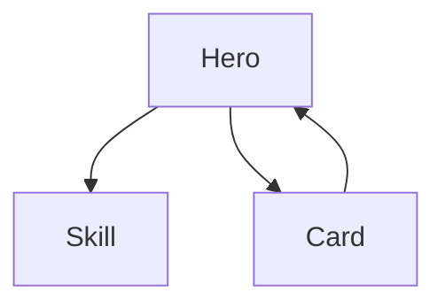

# 记忆存储

本文档详细说明配表分析的记忆存储机制。

## 目录

- [记忆存储策略](#记忆存储策略)
- [存储类型](#存储类型)
- [记忆更新](#记忆更新)
- [使用示例](#使用示例)

---

## 记忆存储策略

本技能支持多种记忆存储方式，按优先级自动选择。

### 优先级顺序

```
1. MCP 记忆服务器 (最高优先级)
   ↓ 不可用
2. 项目记忆目录
   ↓ 不可用
3. 用户全局记忆
   ↓ 不可用
4. 临时文件 (最后降级)
```

### 检测流程

```python
class MemoryStorage:
    """记忆存储管理器"""

    def __init__(self, project_dir: str = None):
        self.project_dir = Path(project_dir) if project_dir else None
        self.memory_type = None
        self.storage_path = None

        # 检测可用的记忆类型
        self._detect_memory_type()

    def _detect_memory_type(self):
        """检测可用的记忆类型"""
        # 1. 检查 MCP 记忆服务器
        mcp_servers = self._check_mcp_servers()
        if mcp_servers:
            self.memory_type = "mcp"
            self.storage_path = mcp_servers[0]
            return

        # 2. 检查项目记忆目录
        if self.project_dir:
            project_memory = self.project_dir / ".claude" / "memory"
            if project_memory.exists():
                self.memory_type = "project"
                self.storage_path = project_memory
                return

        # 3. 检查用户全局记忆
        global_memory = Path.home() / ".claude" / "projects"
        if self.project_dir:
            project_name = self.project_dir.name
            project_global_memory = global_memory / project_name / "memory"
            if project_global_memory.exists():
                self.memory_type = "global"
                self.storage_path = project_global_memory
                return

        # 4. 使用临时文件
        self.memory_type = "temp"
        self.storage_path = Path.cwd() / "MEMORY.md"

    def _check_mcp_servers(self) -> List[str]:
        """检查可用的 MCP 记忆服务器"""
        try:
            # 尝试列出 MCP 服务器
            mcp_resources = list_mcp_resources()
            memory_servers = [
                r for r in mcp_resources
                if any(keyword in r.lower() for keyword in ["mem0", "recall", "memory"])
            ]
            return memory_servers
        except:
            return []
```

---

## 存储类型

### 1. MCP 记忆服务器

**特点**：
- 最高优先级
- 支持语义搜索
- 自动去重和更新

**存储格式**：
```json
{
  "category": "config-analysis",
  "project": "server",
  "content": {
    "timestamp": "2025-01-15T10:30:00",
    "tables": {
      "total": 10,
      "center": ["Hero", "Skill", "Card"],
      "edge": ["Buff", "Arena"]
    },
    "constraints": [
      {
        "table": "Hero",
        "field": "OpenDate",
        "rule": "战令武将 ∈ [SeasonPass.StartTime, EndTime]"
      }
    ],
    "relations": [
      {
        "source": "Card",
        "target": "Hero",
        "field": "HeroId"
      }
    ]
  },
  "tags": ["config", "analysis", "hero", "skill"]
}
```

### 2. 项目记忆目录

**路径**：`{项目}/.claude/memory/config-analysis-memory.md`

**格式**：
```markdown
# {项目名} 配表分析记忆

## 最后更新
2025-01-15 10:30:00

## 配表快照
- 总表数: 10
- 中心表: Hero, Skill, Card
- 边缘表: Buff, Arena
- 分析时间: 2025-01-15 10:30:00

## 关键发现
- Hero 表是核心表，被 Card、ArenaScoreRewards 等表引用
- 战令武将 OpenDate 必须在 SeasonPass 时间范围内
- 大将军武将 OpenDate 必须等于 ArenaSeason.SeasonStartTime

## 约束规则摘要
| 表 | 字段 | 约束 |
|----|------|------|
| Hero | OpenDate | 战令武将 ∈ [SeasonPass.StartTime, EndTime] |
| Hero | OpenDate | 大将军武将 = ArenaSeason.SeasonStartTime |
| Activity | StartTime | StartTime < EndTime |

## 关系图摘要


## 可疑配置
- 无

## 变更历史
| 日期 | 变更 |
|------|------|
| 2025-01-15 | 首次分析 |
```

### 3. 用户全局记忆

**路径**：`~/.claude/projects/{项目名}/memory/config-analysis-memory.md`

**格式**：与项目记忆目录相同

### 4. 临时文件

**路径**：`{输出目录}/MEMORY.md`

**格式**：简化版记忆文件

```markdown
# 配表分析临时记忆

生成时间: 2025-01-15 10:30:00

## 分析结果
- 扫描了 10 个配表文件
- 发现 15 个引用关系
- 提取了 8 个约束规则

## 详细结果
[完整分析结果]
```

---

## 记忆更新

### 更新时机

1. **首次分析** - 创建新的记忆文件
2. **增量分析** - 更新现有记忆，标记变更
3. **发现新规则** - 追加到约束规则摘要
4. **检测问题** - 记录到可疑配置部分

### 更新方法

```python
class MemoryStorage:
    """记忆存储管理器（续）"""

    def save_analysis(self, analysis_result: Dict, project_name: str = None):
        """保存分析结果到记忆"""
        if self.memory_type == "mcp":
            self._save_to_mcp(analysis_result, project_name)
        elif self.memory_type in ["project", "global", "temp"]:
            self._save_to_file(analysis_result, project_name)

    def _save_to_file(self, analysis_result: Dict, project_name: str = None):
        """保存到文件"""
        memory_file = self.storage_path / "config-analysis-memory.md"

        # 检查是否已存在
        if memory_file.exists():
            # 增量更新
            self._update_existing_memory(memory_file, analysis_result)
        else:
            # 创建新记忆
            self._create_new_memory(memory_file, analysis_result, project_name)

    def _create_new_memory(self, memory_file: Path, analysis_result: Dict, project_name: str):
        """创建新的记忆文件"""
        content = self._format_memory_content(analysis_result, project_name)

        with open(memory_file, 'w', encoding='utf-8') as f:
            f.write(content)

    def _update_existing_memory(self, memory_file: Path, new_analysis: Dict):
        """更新现有记忆文件"""
        # 读取现有内容
        with open(memory_file, 'r', encoding='utf-8') as f:
            existing_content = f.read()

        # 解析现有内容
        existing_data = self._parse_memory_content(existing_content)

        # 合并新数据
        merged_data = self._merge_analysis_data(existing_data, new_analysis)

        # 重新格式化并保存
        new_content = self._format_memory_content(merged_data)

        with open(memory_file, 'w', encoding='utf-8') as f:
            f.write(new_content)

    def _merge_analysis_data(self, existing: Dict, new_data: Dict) -> Dict:
        """合并分析数据"""
        merged = existing.copy()

        # 更新时间戳
        merged["last_update"] = new_data.get("timestamp")

        # 合并约束规则
        existing_constraints = {c["id"]: c for c in existing.get("constraints", [])}
        new_constraints = {c["id"]: c for c in new_data.get("constraints", [])}
        existing_constraints.update(new_constraints)
        merged["constraints"] = list(existing_constraints.values())

        # 合并关系
        existing_relations = {r["id"]: r for r in existing.get("relations", [])}
        new_relations = {r["id"]: r for r in new_data.get("relations", [])}
        existing_relations.update(new_relations)
        merged["relations"] = list(existing_relations.values())

        # 添加变更记录
        if "changes" not in merged:
            merged["changes"] = []
        merged["changes"].append({
            "timestamp": new_data.get("timestamp"),
            "type": "update",
            "summary": f"更新分析，发现 {len(new_data.get('constraints', []))} 个约束"
        })

        return merged

    def load_analysis(self) -> Dict:
        """加载记忆中的分析结果"""
        memory_file = self.storage_path / "config-analysis-memory.md"

        if not memory_file.exists():
            return {}

        with open(memory_file, 'r', encoding='utf-8') as f:
            content = f.read()

        return self._parse_memory_content(content)
```

---

## 使用示例

### 创建记忆存储

```python
# 创建记忆存储实例
memory = MemoryStorage(project_dir="/path/to/project")

# 查看记忆类型
print(f"使用记忆类型: {memory.memory_type}")
print(f"存储路径: {memory.storage_path}")
```

### 保存分析结果

```python
# 执行分析
analyzer = ConfigAnalyzer(config_dir)
scan_result = analyzer.scan_directory()
relations = analyzer.analyze_relations(scan_result)
constraints = analyzer.extract_constraints(scan_result)

# 保存到记忆
analysis_result = {
    "timestamp": datetime.now().isoformat(),
    "scan_result": scan_result,
    "relations": relations,
    "constraints": constraints
}

memory.save_analysis(analysis_result, project_name="server")
```

### 加载记忆

```python
# 加载记忆中的分析
existing_analysis = memory.load_analysis()

if existing_analysis:
    print(f"上次分析时间: {existing_analysis.get('last_update')}")
    print(f"已识别约束: {len(existing_analysis.get('constraints', []))} 个")
```

### 增量更新

```python
# 增量分析：只分析变更的表
changed_tables = ["Hero.xlsx"]

# 执行增量分析
new_constraints = analyzer.extract_constraints_for_tables(changed_tables)

# 保存更新（会自动合并到现有记忆）
memory.save_analysis({
    "timestamp": datetime.now().isoformat(),
    "constraints": new_constraints,
    "changes": changed_tables
})
```

---

## 记忆文件格式

### 完整模板

```markdown
# {项目名} 配表分析记忆

## 最后更新
{时间戳}

## 配表快照
- 总表数: {数量}
- 中心表: {列表}
- 边缘表: {列表}
- 分析时间: {时间}

## 关键发现
- {发现 1}
- {发现 2}

## 约束规则摘要
| 表 | 字段 | 约束 |
|----|------|------|
| ... | ... | ... |

## 关系图摘要


## 可疑配置
- {问题 1}
- {问题 2}

## 变更历史
| 日期 | 变更 |
|------|------|
| ... | ... |
```

### 渐进式披露格式

为保持记忆文件可读，使用渐进式披露：

1. **顶部摘要** - < 200 行，最关键信息
2. **详细折叠** - 使用 `<details>` 标签折叠详细内容
3. **分文件存储** - 大型内容存储到单独文件

```markdown
# 配表分析记忆

## 摘要
<200 行关键信息>

## 详细内容

<details>
<summary>完整约束列表 (点击展开)</summary>

| 表 | 字段 | 约束 | 优先级 |
|----|------|------|--------|
| ... | ... | ... | ... |

</details>

<details>
<summary>完整关系图 (点击展开)</summary>


</details>
```
