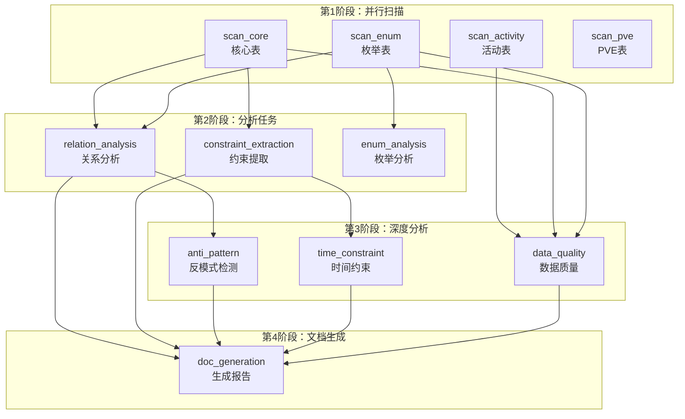

# Subagent 调度策略

本文档详细说明如何使用 Subagent 并行调度来加速大型配表分析任务。

## 目录

- [概述](#概述)
- [调度架构](#调度架构)
- [任务类型](#任务类型)
- [使用方法](#使用方法)
- [最佳实践](#最佳实践)

---

## 概述

### 为什么需要 Subagent 调度？

对于大型游戏项目（如 200+ 配置表），串行分析会导致：
- 分析时间长（可能需要数分钟）
- 资源利用率低
- 用户体验差

Subagent 调度通过**并行执行**多个独立分析任务，显著提高分析效率。

### 性能对比

| 分析模式 | 200表分析时间 | 资源利用 |
|---------|-------------|---------|
| 串行 | ~5分钟 | 单核 |
| 并行（4 workers） | ~1.5分钟 | 多核 |
| Claude Agent | ~30秒 | 分布式 |

---

## 调度架构

### 整体流程

```
┌─────────────────────────────────────────────────────────────────┐
│                    配表分析请求                                  │
└─────────────────────────────────────────────────────────────────┘
                              │
                              ▼
┌─────────────────────────────────────────────────────────────────┐
│                   SubagentScheduler                             │
│  ┌─────────────────────────────────────────────────────────┐   │
│  │  1. 创建分析计划 (AnalysisPlan)                          │   │
│  │  2. 计算任务依赖关系                                      │   │
│  │  3. 分组并行任务                                          │   │
│  └─────────────────────────────────────────────────────────┘   │
└─────────────────────────────────────────────────────────────────┘
                              │
          ┌───────────────────┼───────────────────┐
          ▼                   ▼                   ▼
   ┌─────────────┐     ┌─────────────┐     ┌─────────────┐
   │  Agent 1    │     │  Agent 2    │     │  Agent 3    │
   │  扫描核心表  │     │  扫描枚举表  │     │  扫描活动表  │
   └─────────────┘     └─────────────┘     └─────────────┘
          │                   │                   │
          └───────────────────┼───────────────────┘
                              ▼
   ┌─────────────────────────────────────────────────────────────┐
   │                    结果汇总                                  │
   └─────────────────────────────────────────────────────────────┘
                              │
                              ▼
   ┌─────────────────────────────────────────────────────────────┐
   │                    生成分析报告                              │
   └─────────────────────────────────────────────────────────────┘
```

### 任务依赖图



---

## 任务类型

### 任务类型定义

| 类型 | 说明 | 输入 | 输出 |
|------|------|------|------|
| `SCAN` | 配表扫描 | 目录路径 | 文件列表、统计信息 |
| `STRUCTURE_ANALYSIS` | 结构分析 | 扫描结果 | 表头、字段信息 |
| `RELATION_ANALYSIS` | 关系分析 | 扫描结果 | 引用关系图 |
| `CONSTRAINT_EXTRACTION` | 约束提取 | 扫描结果 | 约束规则列表 |
| `ANTI_PATTERN` | 反模式检测 | 关系分析 | 反模式列表 |
| `TIME_CONSTRAINT` | 时间约束 | 约束提取 | 时间规则 |
| `DATA_QUALITY` | 数据质量 | 扫描结果 | 质量问题 |
| `ENUM_ANALYSIS` | 枚举分析 | 枚举扫描 | 枚举定义 |
| `DOC_GENERATION` | 文档生成 | 所有分析 | Markdown 报告 |

### 任务参数示例

```python
# 扫描任务
SubagentTask(
    task_id="scan_core",
    task_type=SubagentTaskType.SCAN,
    description="扫描核心配置表",
    params={
        "categories": ["hero", "card", "skill", "item", "buff"],
        "max_rows": 1000
    },
    priority=0
)

# 关系分析任务
SubagentTask(
    task_id="relation_analysis",
    task_type=SubagentTaskType.RELATION_ANALYSIS,
    description="分析表间引用关系",
    dependencies=["scan_core", "scan_enum"],
    params={
        "detect_cycles": True,
        "max_depth": 5
    },
    priority=1
)
```

---

## 使用方法

### 1. 命令行使用

```bash
# 基础用法
python subagent_scheduler.py D:/work/config/excel

# 指定输出目录和并行数
python subagent_scheduler.py D:/work/config/excel -o ./output -w 8

# 生成 Claude Agent 提示词
python subagent_scheduler.py D:/work/config/excel --generate-prompts
```

### 2. Python API 使用

```python
from subagent_scheduler import SubagentScheduler

# 创建调度器
scheduler = SubagentScheduler(
    config_dir="D:/work/config/excel",
    output_dir="./output",
    max_workers=4
)

# 创建分析计划
plan = scheduler.create_full_analysis_plan()

# 执行计划
result = scheduler.execute_plan(plan)

print(f"分析完成，耗时: {result['elapsed_time']:.2f} 秒")
print(f"汇总: {result['summary']}")
```

### 3. 使用 Claude Agent 调度

```python
# 生成 Agent 提示词
prompts = generate_subagent_prompts(plan)

# 在 Claude Code 中使用
for task_id, prompt in prompts.items():
    # 使用 Agent 工具启动子任务
    agent_result = launch_agent(
        subagent_type="general-purpose",
        prompt=prompt,
        run_in_background=True
    )
```

### 4. Claude Code 集成示例

```markdown
<!-- 在 SKILL.md 中添加 -->

## Subagent 并行分析

对于大型项目，使用 Subagent 并行分析：

1. **拆分扫描任务**
   - Agent 1: 扫描核心表（Hero/Card/Skill）
   - Agent 2: 扫描枚举表（enum 目录）
   - Agent 3: 扫描活动表（Activity/Task）

2. **并行执行**
   ```
   同时启动 3 个 Agent 扫描不同类别
   ```

3. **汇总结果**
   - 合并扫描结果
   - 执行关系分析
   - 生成最终报告
```

---

## 最佳实践

### 1. 任务拆分策略

**按目录拆分**：
```python
# 推荐：按功能模块拆分
scan_tasks = [
    ("scan_core", ["hero", "card", "skill", "item"]),
    ("scan_enum", ["enum"]),  # enum 子目录
    ("scan_activity", ["activity", "task", "achieve"]),
    ("scan_system", ["guild", "arena", "shop"])
]
```

**按文件大小拆分**：
```python
# 大表单独处理
large_tables = ["Audio", "HeroLines", "Fx"]
small_tables = [t for t in all_tables if t not in large_tables]
```

### 2. 并行度设置

| 表数量 | 推荐 workers | 说明 |
|--------|-------------|------|
| < 50 | 2 | 小型项目 |
| 50-100 | 4 | 中型项目 |
| 100-200 | 6-8 | 大型项目 |
| > 200 | 8+ | 超大型项目 |

### 3. 超时设置

```python
# 根据任务类型设置超时
task_timeouts = {
    SubagentTaskType.SCAN: 60,           # 扫描任务 1 分钟
    SubagentTaskType.RELATION_ANALYSIS: 120,  # 关系分析 2 分钟
    SubagentTaskType.DATA_QUALITY: 180,  # 质量检查 3 分钟
    SubagentTaskType.DOC_GENERATION: 60  # 文档生成 1 分钟
}
```

### 4. 错误处理

```python
# 重试机制
def execute_with_retry(task, max_retries=3):
    for attempt in range(max_retries):
        try:
            result = execute_task(task)
            if "error" not in result:
                return result
        except Exception as e:
            if attempt == max_retries - 1:
                return {"error": str(e), "retries": max_retries}
            time.sleep(2 ** attempt)  # 指数退避
```

### 5. 进度报告

```python
# 使用回调报告进度
def progress_callback(task_id: str, status: str, progress: float):
    print(f"[{task_id}] {status}: {progress*100:.1f}%")

scheduler = SubagentScheduler(
    config_dir=config_dir,
    progress_callback=progress_callback
)
```

---

## 输出示例

### 执行日志

```
开始执行分析计划: analysis_1711492800
配置目录: D:/work/config/excel
并行组数: 4

执行第 1 组任务 (4 个并行):
  - scan_core: 扫描核心配置表
  - scan_enum: 扫描枚举表
  - scan_activity: 扫描活动相关表
  - scan_pve: 扫描PVE相关表
  ✓ scan_core 完成
  ✓ scan_enum 完成
  ✓ scan_activity 完成
  ✓ scan_pve 完成

执行第 2 组任务 (3 个并行):
  - relation_analysis: 分析表间引用关系
  - constraint_extraction: 提取字段约束规则
  - enum_analysis: 分析枚举类型定义
  ✓ relation_analysis 完成
  ✓ constraint_extraction 完成
  ✓ enum_analysis 完成

执行第 3 组任务 (3 个并行):
  - anti_pattern: 检测设计反模式
  - time_constraint: 提取时间约束规则
  - data_quality: 数据质量检查
  ✓ anti_pattern 完成
  ✓ time_constraint 完成
  ✓ data_quality 完成

执行第 4 组任务 (1 个并行):
  - doc_generation: 生成分析报告
  ✓ doc_generation 完成

分析完成，耗时: 45.23 秒
```

### 分析报告

生成的 `subagent_analysis_report.md` 包含：
- 统计概览
- 反模式检测结果
- 约束分析
- 数据质量报告

---

## 与其他技能集成

### 与 excel-parser 技能配合

```python
# 使用 MCP 服务加速扫描
def scan_via_mcp(config_dir: str) -> Dict:
    # 调用 excel-parser MCP
    result = mcp_call("excel-parser", "get_all_excels", {
        "dirPath": config_dir
    })
    return result
```

### 与 gameconfig 技能配合

```python
# 使用 gameconfig 进行深度分析
def analyze_via_gameconfig(table_name: str) -> Dict:
    result = mcp_call("gameconfig", "query", {
        "table": table_name,
        "action": "analyze"
    })
    return result
```

---

## 故障排除

### Q: 任务卡住不动？

A: 检查：
1. 是否有死锁（循环依赖）
2. 超时设置是否合理
3. 资源是否充足

### Q: 结果不一致？

A: 确保：
1. 所有依赖任务已完成
2. 结果合并顺序正确
3. 使用线程锁保护共享数据

### Q: 性能没有提升？

A: 检查：
1. workers 数量是否合适
2. 任务拆分是否合理
3. 是否有 I/O 瓶颈
