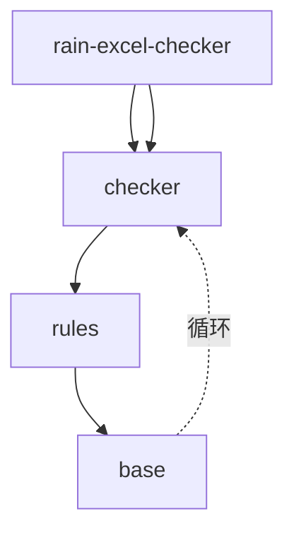

# 模块架构图

## 能力说明

生成 Go 项目的模块依赖关系图，展示包之间的分层结构、依赖方向和循环依赖问题。

## 输出内容

### 1. 依赖关系图
- **节点**：每个 Go 包/模块
- **边**：import 依赖关系（箭头指向被依赖方）
- **颜色标记**：
  - 绿色：健康依赖（单向、分层清晰）
  - 黄色：跨层依赖（如底层包反向依赖上层）
  - 红色：循环依赖（A→B→A）

### 2. 目录结构树
- 文件系统层级视图
- 标注每个目录的 Go 包名
- 显示 `go.mod` 模块边界

### 3. 模块分层分析
- 识别典型的三层架构：domain/service/infrastructure
- 标注违反分层原则的依赖

## 调用示例

```bash
# 生成完整架构图
/go-model -v architecture -f html

# 限定分析范围（大型项目必备）
/go-model -v architecture -s rain-excel-checker

# 导出 Mermaid 图表（嵌入文档）
/go-model -v architecture -f mermaid -o docs/arch.md

# 快速 ASCII 查看终端
/go-model -v architecture -f mermaid --width=cjk-2x
```

## 输出示例

### Mermaid 格式


### ASCII 格式
```
┌─────────────────────────┐
│  rain-excel-checker     │
│  (cmd/main.go)          │
└───────────┬─────────────┘
            │
     ┌──────┴──────┐
     ▼             ▼
┌─────────┐  ┌─────────┐
│  xlsx   │  │ checker │
└────┬────┘  └────┬────┘
     │            │
     └────┬───────┘
          ▼
   ┌─────────────┐
   │   rules     │
   └──────┬──────┘
          │
     ┌────┴────┐
     ▼         ▼
┌────────┐ ┌──────┐
│  base  │ │⚠️循环│
└────────┘ └──────┘
```

## 数据来源

- `go mod graph`：跨模块依赖
- `go list -json ./...`：包级别元数据
- `go/ast`：文件级 import 解析

## 健康度指标

架构图会自动计算：
- **依赖深度**：最长依赖链长度
- **扇入扇出比**：包的被依赖/依赖数量
- **环路检测**：识别所有循环依赖

## 限制条件

- 大型项目（>500 包）必须使用 `--scope` 限定范围
- CGO 包可能无法完整解析
- vendor 目录默认排除

## 相关文档

- [代码健康度/噪声度](health-metrics.md) — 依赖复杂度评分
- [调用流/数据流图](call-flow.md) — 运行时调用链
