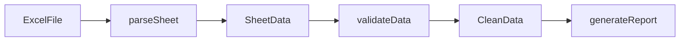

# 调用流/数据流图

## 能力说明

追踪函数调用链、数据流向和模块间交互，展示代码的动态执行路径。

## 两种视图

### 1. 调用流图（静态分析）
展示函数之间的调用关系，基于 `go/ast` 和 `golang.org/x/tools/go/callgraph`。

**应用场景**：
- "这个函数被哪些地方调用了？"
- "理解代码执行路径"
- "发现潜在的循环调用"

**输出示例**：
```
main()
  └→ LoadExcel()
      └→ parseSheet()
          ├→ parseRules()
          └→ validateData()
              └→ Checker.Check()
```

### 2. 数据流图（值传播）
追踪数据在函数间的传递路径，展示参数如何流动、转换。

**应用场景**：
- "这个数据结构经历了哪些处理步骤？"
- "定位数据污染点"
- "理解业务流程"

**输出示例**：
```
ExcelFile
  └→ [parse] → SheetData
      ├→ [validate] → CleanData
      └→ [enrich] → EnrichedData
          └→ [export] → Report
```

## 可视化方式

### 1. Mermaid 流程图


### 2. ASCII 流向图
```
┌────────────┐
│ ExcelFile  │
└─────┬──────┘
      │ parseSheet()
      ▼
┌────────────┐
│ SheetData  │
└─────┬──────┘
      │ validateData()
      ▼
┌────────────┐
│ CleanData  │
└────────────┘
```

### 3. HTML5 交互图
- 可拖拽节点，重新布局
- 点击节点显示函数签名
- 高亮路径：选择两个节点，显示依赖链
- 搜索函数名快速定位

## 调用示例

```bash
# 查看完整调用流
/go-model -v callflow -f html

# 追踪特定函数
/go-model -v callflow --func=LoadExcel

# 数据流分析
/go-model -v callflow --type=ExcelFile --mode=dataflow

# 生成 Mermaid 图表
/go-model -v callflow -f mermaid -o docs/callflow.md
```

## 数据来源

### Phase 1（基础实现）
- `go/ast`：解析函数调用表达式
- 正则表达式：简单调用链提取
- 导入分析：跨包调用关系

### Phase 2（完整实现）
- `golang.org/x/tools/go/callgraph`：精确调用图
- `golang.org/x/tools/go/ssa`：静态单赋值形式分析
- `goda`：调用图可视化工具

## 分析深度

| 模式 | 分析范围 | 性能 |
|------|---------|------|
| 包级 | 仅当前包内调用 | 快 |
| 模块级 | 跨包调用，同一模块 | 中 |
| 全局级 | 包含标准库和第三方依赖 | 慢 |

默认使用模块级分析，可通过 `--depth` 参数调整。

## 限制条件

- **动态调用**：反射、接口断言无法静态分析
- **并发调用**：goroutine 启动点标注，但异步流不追踪
- **代码生成**：`*.pb.go` 等生成代码默认排除

## 健康度集成

调用流图会自动标注：
- 🔴 深度 >10 的调用链（可能过度耦合）
- 🟡 跨层调用（如 infrastructure → domain）
- ⚪ 循环调用（A→B→A）

## 相关文档

- [架构图](architecture-diagram.md) — 模块级依赖关系
- [类型关系图](type-relationship.md) — 结构体组合层级
