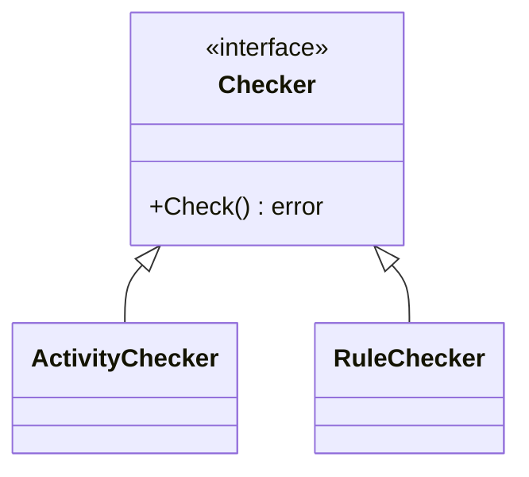

# 接口实现导航

## 能力说明

追踪 Go 语言的隐式接口实现关系，提供正向（interface→struct）和逆向（struct→interface）双向导航。

## 双向导航

### 正向：interface → struct
给定一个接口，找出所有满足该接口的结构体。

**应用场景**：
- "这个接口有哪些实现？"
- "我能替换哪个实现类？"
- "找到所有可用的策略实现"

### 逆向：struct → interface
给定一个结构体，列出它隐式满足的所有接口。

**应用场景**：
- "这个结构体可以当作哪些接口使用？"
- "这里能否传入另一个实现？"
- "发现隐式抽象，重构为显式接口"

## 可视化方式

### 1. ASCII 导航树
```
<<interface>> Checker
├── ActivityChecker ✓
├── RuleChecker ✓
└── ResourceChecker ⚠️ (缺少 Validate())
```

### 2. Mermaid 关系图


### 3. HTML5 交互面板
- 双栏布局：左侧接口树，右侧实现列表
- 点击跳转到源文件
- 路径高亮（显示依赖链）
- 键盘导航：方向键移动，Enter 展开，Esc 返回

## 接口满足度报告

检测"几乎满足"但缺少方法的 struct，提前发现潜在编译错误。

**规则**：仅匹配方法数 ≥ 3 的 interface（减少误报）

**输出示例**：
```
⚠️ ResourceChecker 几乎满足 Checker：
  ✓ Check() error
  ✓ Name() string
  ✗ Validate() bool  ← 缺少此方法
```

## 调用示例

```bash
# 查看所有接口导航
/go-model -v interfaces -f html

# 正向查找：某个接口的实现
/go-model -v interfaces --interface=Checker

# 逆向查找：某个结构体满足的接口
/go-model -v interfaces --struct=ActivityChecker

# 导出 JSON 供 subagent 使用
/go-model -v interfaces -f json -o interface-map.json
```

## JSON 输出格式

```json
{
  "interface": "Checker",
  "implements": [
    {
      "struct": "ActivityChecker",
      "file": "xlsx/activity/checker.go",
      "methods": ["Check", "Name", "Validate"],
      "complete": true
    },
    {
      "struct": "ResourceChecker",
      "file": "resource/checker.go",
      "missing": ["Validate"],
      "complete": false
    }
  ]
}
```

## 数据来源

- `go/types` 类型检查器：精确匹配接口满足关系
- `go/ast`：提取接口和结构体定义
- `golang.org/x/tools/go/ssa`：可选，用于更精确的分析

## 检测规则

1. **方法签名完全匹配**：名称、参数、返回值必须一致
2. **接收者类型匹配**：值接收者/指针接收者区分
3. **泛型接口支持**：Phase 2 实现
4. **嵌入接口**：展开为完整方法集

## 限制条件

- 仅分析当前包及子包（跨包接口需要完整模块加载）
- 接口方法数 < 3 的不显示满足度报告
- 匿名接口（`interface{}`）不分析

## 相关文档

- [类型关系图](type-relationship.md) — struct 组合/embedding 层级
- [调用流](call-flow.md) — 运行时接口调用链
