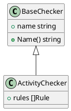

# 提取工具技术细节

## 概述

本文档详细说明数据层使用的 Go 工具链，包括工具安装、调用方式和输出解析。

## 核心工具列表

| 工具 | 安装方式 | 用途 | 必需 |
|------|---------|------|------|
| `go list` | Go 内置 | 模块依赖、包列表 | 是 |
| `go mod graph` | Go 内置 | 依赖图 | 是 |
| `go vet` | Go 内置 | 死代码、composites 检查 | 是 |
| `goplantuml` | `go install` | struct/interface 关系提取 | 否（可降级） |
| `goda` | `go install` | 调用图分析 | 否（可降级） |
| `gocognit` | `go install` | 圈复杂度 | 否（可降级） |

## 工具详解

### 1. go list

#### 获取所有包
```bash
go list -json ./...
```

**输出字段**：
```json
{
  "ImportPath": "github.com/user/project",
  "Name": "main",
  "Imports": ["fmt", "os"],
  "Deps": [
    "github.com/pkg/errors",
    "golang.org/x/text"
  ]
}
```

#### 获取包元数据
```bash
go list -f '{{.ImportPath}} {{.Imports}}' ./...
```

**用途**：
- 模块依赖关系
- 包列表
- 导入分析

### 2. go mod graph

#### 生成依赖图
```bash
go mod graph
```

**输出格式**：
```
github.com/user/project@v1.0.0 github.com/pkg/errors@v0.9.1
github.com/user/project@v1.0.0 golang.org/x/text@v0.3.2
```

**解析逻辑**：
```bash
go mod graph | awk '{print $1, $2}' | sort -u
```

**用途**：
- 跨模块依赖
- 传递依赖分析
- 循环依赖检测

### 3. go vet

#### 死代码检测
```bash
go vet -deadcode ./...
```

**输出示例**：
```
myfile.go:12:6: func unused is unused
```

#### Composite 检测
```bash
go vet composites ./...
```

**用途**：
- 未引用函数检测
- 接口满足度检查
- 可疑代码模式

### 4. goplantuml

#### 安装
```bash
go install github.com/jfeliu007/goplantuml/cmd/goplantuml@latest
```

#### 生成 PlantUML
```bash
goplantuml -recursive ./...
```

**输出示例**：


**解析逻辑**：
- 提取 `class` 定义
- 解析继承关系（`<|--`）
- 提取字段和方法

**降级方案**：
若未安装，使用 `go/ast` 自行解析：
```go
ast.Inspect(node, func(n ast.Node) bool {
    if ts, ok := n.(*ast.TypeSpec); ok {
        // 提取结构体定义
    }
    return true
})
```

### 5. goda

#### 安装
```bash
go install github.com/loov/goda@latest
```

#### 调用图分析
```bash
goda graph .
```

**输出格式**：
```
main -> LoadExcel
LoadExcel -> parseSheet
parseSheet -> validateData
```

**用途**：
- 函数调用链
- 静态调用图
- 跨包调用分析

**降级方案**：
使用 `go list -json` 解析导入关系：
```bash
go list -json -export ./... | jq '.Imports'
```

### 6. gocognit

#### 安装
```bash
go install github.com/uudashr/gocognit/cmd/gocognit@latest
```

#### 圈复杂度分析
```bash
gocognit ./...
```

**输出示例**：
```
 myfile.go:23:10: processFile 18
```

**评分规则**：
- 1-10：健康
- 11-20：关注
- 21+：混乱

**降级方案**：
使用行数估算：
```
complexity ≈ lines / 10
```

## Shell 胶水脚本

### 统一入口：run-extract.sh

```bash
#!/usr/bin/env bash

set -euo pipefail

PROJECT_ROOT=${1:-.}
OUTPUT_DIR=${2:-.modeler/tmp}

mkdir -p "$OUTPUT_DIR"

# 1. 包列表
echo "提取包列表..."
go list -json "$PROJECT_ROOT/..." > "$OUTPUT_DIR/packages.json"

# 2. 依赖图
echo "提取依赖图..."
go mod graph > "$OUTPUT_DIR/deps.txt"

# 3. 调用图（可选）
if command -v goda &> /dev/null; then
    echo "提取调用图..."
    goda graph "$PROJECT_ROOT" > "$OUTPUT_DIR/callgraph.txt"
fi

# 4. 圈复杂度（可选）
if command -v gocognit &> /dev/null; then
    echo "计算圈复杂度..."
    gocognit "$PROJECT_ROOT/..." > "$OUTPUT_DIR/complexity.txt"
fi

echo "提取完成：$OUTPUT_DIR"
```

### 前置检查：check-deps.sh

```bash
#!/usr/bin/env bash

# 检查是否为 Go 项目
if [ ! -f "go.mod" ]; then
    echo "错误：不是 Go 项目（缺少 go.mod）"
    exit 1
fi

# 检查 go list 是否可用
if ! go list ./... &> /dev/null; then
    echo "警告：go list 失败，项目可能有编译错误"
    echo "降级为低精度模式..."
    exit 2
fi

# 检查可选工具
optional_tools=("goplantuml" "goda" "gocognit")
missing_tools=()

for tool in "${optional_tools[@]}"; do
    if ! command -v "$tool" &> /dev/null; then
        missing_tools+=("$tool")
    fi
done

if [ ${#missing_tools[@]} -gt 0 ]; then
    echo "警告：以下工具未安装，将降级对应能力："
    printf "  - %s\n" "${missing_tools[@]}"
fi

exit 0
```

## JSON 数据结构

### packages.json
```json
{
  "packages": [
    {
      "path": "github.com/user/project",
      "name": "main",
      "imports": ["fmt", "os"],
      "exports": ["Main"],
      "files": ["main.go"]
    }
  ]
}
```

### callgraph.json
```json
{
  "nodes": [
    {"id": "main", "type": "function", "file": "main.go"}
  ],
  "edges": [
    {"from": "main", "to": "LoadExcel"}
  ]
}
```

## 错误处理

### 1. 编译错误项目
降级为文本提取：
```bash
grep -r "^func " --include="*.go" | wc -l
```

### 2. CGO 项目
标注跳过：
```bash
go list -f '{{.CgoFiles}}' | grep -v "^$"
```

### 3. 超时处理
单工具 30s 超时：
```bash
timeout 30s go list -json ./... || echo "工具超时"
```

## 相关文档

- [健康度公式详解](health-formulas.md) — 数据如何转换为评分
- [输出模板](output-templates.md) — 最终输出格式
