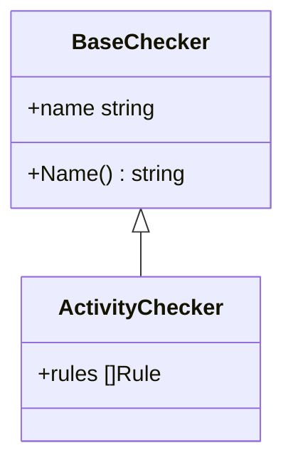

# 类型关系图

## 能力说明

展示 Go 结构体之间的组合关系、embedding 层级和接口实现关系，理解代码的类型架构。

## 三种关系

### 1. 结构体组合（Composition）
一个结构体嵌入另一个结构体作为字段。

**示例**：
```go
type ActivityChecker struct {
    BaseChecker
    rules []Rule
}
```

**可视化**：
```
┌─────────────────────┐
│  ActivityChecker    │
├─────────────────────┤
│ +BaseChecker        │ ◄── 组合
│ +rules []Rule       │
└─────────────────────┘
```

### 2. Embedding（嵌入）
Go 的继承模拟机制，嵌入结构体的方法会被提升到外层。

**示例**：
```go
type BaseChecker struct {
    name string
}

func (b *BaseChecker) Name() string {
    return b.name
}

type ActivityChecker struct {
    BaseChecker  // ← embedding
}
```

**可视化**：
```
        ┌──────────────────┐
        │  BaseChecker     │
        │  +name string    │
        │  +Name() string  │
        └────────▲─────────┘
                 │  embedding
        ┌────────┴─────────┐
        │ ActivityChecker  │
        └──────────────────┘
```

### 3. 接口实现（Interface Satisfaction）
结构体隐式满足接口（详见[接口导航](interface-navigation.md)）。

## 输出格式

### 1. Mermaid 类图


### 2. ASCII 层级图
```
ActivityChecker
├── BaseChecker (embedding)
│   ├── name string
│   └── Name() string
└── rules []Rule
```

### 3. HTML5 交互树
- 可折叠/展开层级
- 点击跳转到定义
- 显示字段类型和方法签名
- 高亮 embedding 链

## 调用示例

```bash
# 查看所有类型关系
/go-model -v types -f html

# 追踪特定结构体
/go-model -v types --struct=ActivityChecker

# 限制深度（避免过深）
/go-model -v types --depth=3

# 只看 embedding
/go-model -v types --relation=embedding
```

## JSON 输出

```json
{
  "struct": "ActivityChecker",
  "fields": [
    {
      "name": "BaseChecker",
      "type": "BaseChecker",
      "embedded": true,
      "path": "xlsx/base/checker.go"
    }
  ],
  "embedding_chain": [
    "ActivityChecker",
    "BaseChecker",
    "Validator"
  ]
}
```

## 数据来源

- `go/ast`：解析结构体定义和字段
- `go/types`：类型解析和 embedding 检测
- `goplantuml`：可选，生成 PlantUML 格式

## 分析特性

### 1. 层级深度检测
标注过深的 embedding 链（>3 层），可能表明过度继承。

### 2. 钻石问题检测
当同一个类型通过多条路径被嵌入时：
```
    A
   / \
  B   C
   \ /
    D
```

### 3. 方法提升冲突
当嵌入多个结构体有同名方法时，标注冲突。

## 限制条件

- 仅分析当前模块（跨模块类型需要完整依赖加载）
- 匿名结构体字段简化显示
- 泛型类型支持：Phase 2

## 健康度集成

类型关系图会自动标注：
- 🔴 embedding 深度 >3
- 🟡 钻石继承
- ⚪ 方法提升冲突

## 相关文档

- [接口导航](interface-navigation.md) — 接口实现关系
- [架构图](architecture-diagram.md) — 模块级依赖
